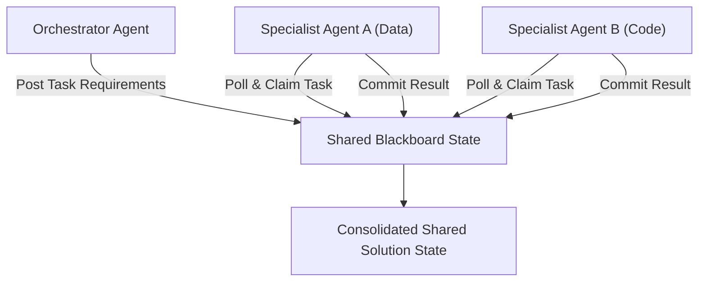

# genpark-blackboard-shared-scratchpad-swarm-skill

Agent Skill implementing the **Blackboard Architectural Pattern for Multi-Agent Swarms** in 100% Python standard library.

## Architectural Flow

